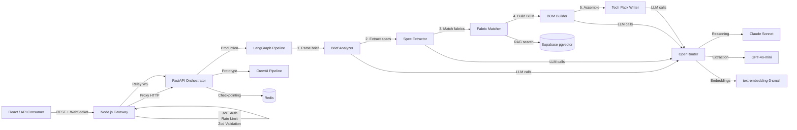

# Fashion Tech Pack AI

A multi-agent AI system that generates structured fashion tech packs from unstructured design inputs. Built with a hybrid Node.js + Python architecture using dual agent frameworks (CrewAI for prototyping, LangGraph for production).

## Architecture



## Tech Stack

| Layer | Technology | Purpose |
|-------|-----------|---------|
| API Gateway | Node.js, Express, TypeScript | Auth, rate limiting, validation, WebSocket relay |
| Orchestration | Python, FastAPI | AI agent orchestration, domain logic |
| Production Agents | LangGraph | Typed state, conditional routing, checkpointing |
| Prototype Agents | CrewAI | Rapid agent role/prompt iteration |
| LLM Routing | OpenRouter | Unified API for multiple models (Claude, GPT-4o) |
| Vector DB | Supabase pgvector | Fabric catalog with semantic search |
| Cache | Redis | Session state, rate limiting |

## Quick Start

### Prerequisites

- Docker and Docker Compose
- OpenRouter API key ([openrouter.ai](https://openrouter.ai))
- Supabase project with pgvector ([supabase.com](https://supabase.com))

### Setup

```bash
# Clone and configure
git clone https://github.com/anglopz/fashion-techpack-ai.git
cd fashion-techpack-ai
cp .env.example .env
# Edit .env with your API keys

# Start all services
docker-compose up --build

# Gateway: http://localhost:3000
# Orchestrator: http://localhost:8000
```

### Local Development (without Docker)

```bash
# Orchestrator
cd orchestrator
pip install -r requirements.txt
uvicorn app.main:app --reload --port 8000

# Gateway (separate terminal)
cd gateway
npm install
npm run dev
```

## API Endpoints

### Tech Packs

```bash
# Create a tech pack (returns 202 with job ID)
curl -X POST http://localhost:3000/api/v1/techpacks \
  -H "Authorization: Bearer <jwt-token>" \
  -H "Content-Type: application/json" \
  -d '{
    "description": "Relaxed-fit organic cotton t-shirt for SS26",
    "garment_type": "top",
    "fabric_preferences": ["organic cotton"],
    "color_palette": ["#2C3E50", "cream"]
  }'

# Check status / get result
curl http://localhost:3000/api/v1/techpacks/tp_abc123 \
  -H "Authorization: Bearer <jwt-token>"

# Stream real-time progress via WebSocket
wscat -c ws://localhost:3000/api/v1/techpacks/tp_abc123/stream
```

### Fabric Catalog

```bash
# Add a fabric
curl -X POST http://localhost:3000/api/v1/fabrics \
  -H "Authorization: Bearer <jwt-token>" \
  -H "Content-Type: application/json" \
  -d '{
    "name": "Organic Cotton Jersey",
    "composition": "100% Organic Cotton",
    "weight_gsm": 180,
    "width_cm": 150,
    "color": "Natural White",
    "care_instructions": ["Machine wash 30°C"]
  }'

# Semantic search
curl "http://localhost:3000/api/v1/fabrics/search?q=lightweight+cotton+summer&limit=5" \
  -H "Authorization: Bearer <jwt-token>"
```

## Agent Pipeline

The LangGraph pipeline processes a design brief through 5 specialized agents:

1. **Brief Analyzer** — Parses unstructured brief, detects garment type, extracts keywords, normalizes colors
2. **Spec Extractor** — Generates measurements with size grading (XS-XL), construction details
3. **Fabric Matcher** — RAG search against pgvector catalog + LLM reranking
4. **BOM Builder** — Generates bill of materials (fabrics, trims, hardware, thread, labels)
5. **Tech Pack Writer** — Assembles complete tech pack document from all agent outputs

A validation node checks the output and conditionally retries (max 2) if required fields are missing.

## CrewAI vs LangGraph

Both frameworks produce the same `TechPack` schema. The project keeps both implementations for benchmarking:

| | CrewAI | LangGraph |
|---|--------|-----------|
| **Endpoint** | `/api/v1/crew/techpacks` | `/api/v1/techpacks` |
| **Purpose** | Rapid prototyping | Production pipeline |
| **State** | Untyped (string passing) | Typed (`TechPackState` dict) |
| **Error Recovery** | None | Conditional retry with validation |
| **Streaming** | None | WebSocket progress events |
| **Checkpointing** | None | MemorySaver (in-memory) |

## Testing

```bash
# Gateway tests (33 tests)
cd gateway && npm test

# Orchestrator tests (105+ tests)
cd orchestrator && python -m pytest -v
```

## Project Structure

```
fashion-techpack-ai/
├── gateway/                  # Node.js API Gateway
│   ├── src/
│   │   ├── index.ts          # Express app factory
│   │   ├── routes/           # techpacks, fabrics, health
│   │   ├── middleware/        # auth, rateLimit, validation
│   │   ├── ws/               # WebSocket relay
│   │   └── types/            # TypeScript interfaces
│   ├── __tests__/            # Jest + supertest
│   └── Dockerfile
├── orchestrator/             # FastAPI + AI Agents
│   ├── app/
│   │   ├── agents/           # LangGraph node functions
│   │   ├── crews/            # CrewAI prototype
│   │   ├── graphs/           # LangGraph workflow
│   │   ├── models/           # Pydantic domain models
│   │   ├── services/         # LLM, RAG, embedding, Redis
│   │   └── api/              # FastAPI endpoints
│   └── tests/
├── docker-compose.yml
└── docs/
    ├── ARCHITECTURE.md
    └── DECISIONS.md
```

## Documentation

- [Architecture](docs/ARCHITECTURE.md) — System design and data flow
- [Decisions](docs/DECISIONS.md) — Architecture Decision Records (ADRs)

## License

MIT
